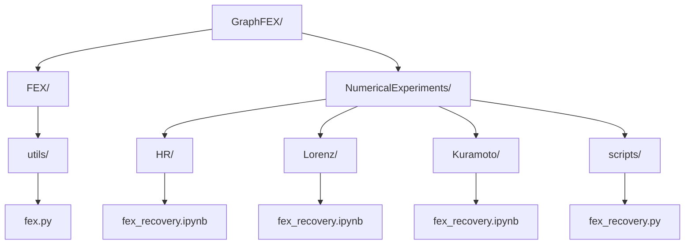

This repository provides two main ways to run and interact with the numerical experiments:

1. Jupyter notebooks: Each experiment directory under NumericalExperiments/ contains a fex_recovery.ipynb notebook for interactively running and analyzing FEX recovery.
2. Command-line interface: NumericalExperiments/scripts/fex_recovery.py provides a Python script for running experiments from the command line, with the desired experiment selected through command-line arguments.

The relevant repository structure is shown below:

### Hyperparameters

| Hyperparameter | Description |
| :--- | :--- |
| **- Controller Parameters -** | |
| controller lr | Step size for weight updates of controller |
| controller epochs | Number of training cycles for controller optimization |
| cands per cycle | Number of candidates evaluate per controller cycle |
| controller threshold | Fraction of candidates used in gradient computation |
| poolsize | Number of candidates saved for finetune optimization |
| **- Coupled FEX Parameters -** | |
| num fex epochs | Number of Adam epochs per candidate in score computation |
| bfgs epochs | Number of lbfgs epochs per candidate in score computation |
| self lr | Step size for weights of self-dynamics FEX |
| inter lr | Step size for weights of interaction-dynamics FEX |
| bfgs lr | Step size for weights of both FEX during lbfgs optim |
| finetune epochs | Number of training cycles for candidate optimization |
| finetune lr | Step size for weights of both FEX during finetuning optim |
| Batch Size | Samples per fex training step |
| Samples | Number of data samples (timesteps) used in training |
| **- Single FEX Parameters -** | |
| num fex epochs | Number of Adam epochs per candidate in score computation |
| bfgs epochs | Number of lbfgs epochs per candidate in score computation |
| self lr | Step size for weights of self-dynamics FEX |
| bfgs lr | Step size for weights of both FEX during lbfgs optim |
| finetune epochs | Number of training cycles for candidate optimization |
| finetune lr | Step size for weights of both FEX during finetuning optim |
| Batch Size | Samples per fex training step |
| Samples | Number of data samples (timesteps) used in training |
